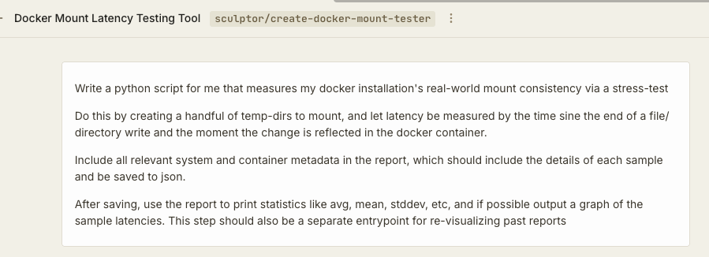
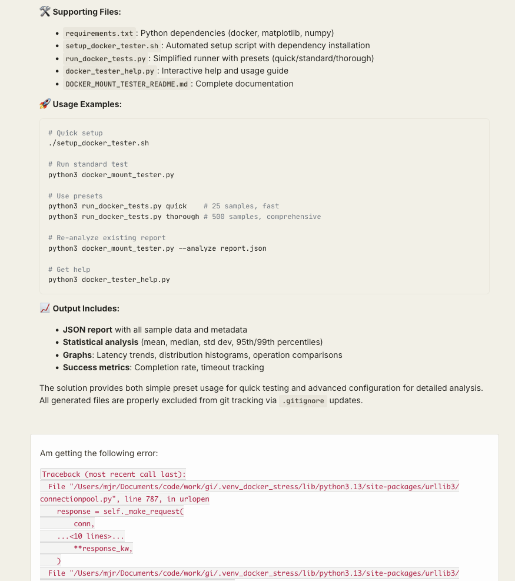
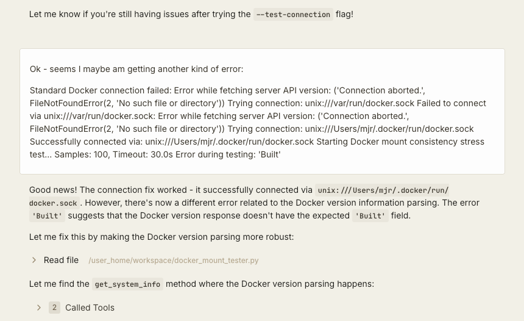
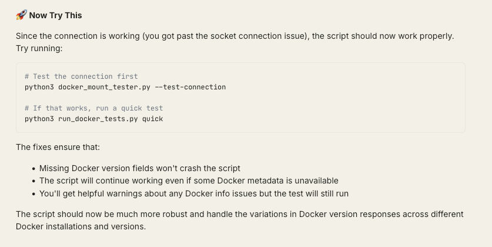
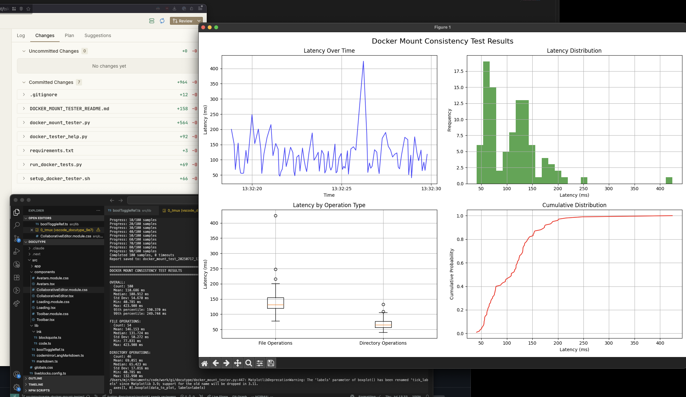

# Sculptor Scratchpad

Various small projects/scripts I've had sculptor throw together for me. 

## [./docker_mount_stress_test]()

When working on local sync and similar issues,
we sometimes had the feeling that virtualized docker mount latency was higher than documented.
Docker docs and articles mostly indicate it is zero,
but a [handful of docker mount issues](https://github.com/search?q=repo%3Adocker%2Ffor-mac+docker+mount+slow&type=issues) made me suspect otherwise.

So tired of fishing around websites and LLM caches for a believable answer,
I asked sculptor to throw together a stress test to see the truth on my machine.

Click to expand chat back and forth

The first pass had a few issues running,
so I reported issues back to sculptor as they cropped up:

After a little bit I got something actually runnable!

I didn't scrutinize the code that much except to verify the latency time deltas weren't being obviously fudged.
But to me, the final result seemed plausible and alleviated some of my concerns for the time being
(there would have had to be near-second latency in the case we were investigating).

> Note: likely the reported times are higher due to instrumentation

### Personal Takeaway
While naturally this exact scenario would be particularly tricky due to the docker usage,
I'm looking forward to enabling `sculptor` to iterate on it's own code and push this kind of rich media through to the frontend as artifacts.
